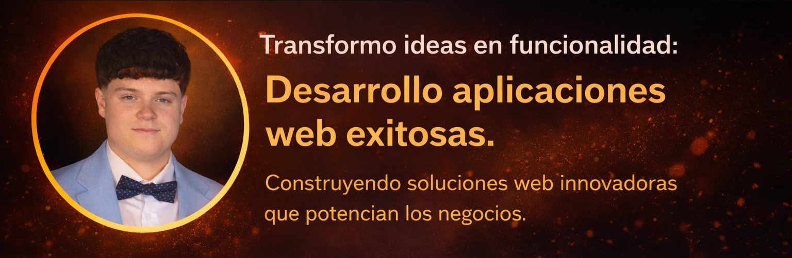

# ¡Hola! 👋 Soy Álvaro Castilla González

### Desarrollador Full-Stack | Apasionado por la Tecnología e Innovación

---

## 🎯 Acerca de Mí

Soy un desarrollador full-stack dedicado a transformar ideas innovadoras en soluciones tecnológicas robustas y escalables. Mi pasión radica en crear aplicaciones que no solo resuelven problemas complejos, sino que generan un impacto positivo tangible. 

Estoy comprometido con el aprendizaje continuo, el crecimiento profesional y la excelencia en el desarrollo de software. Busco colaborar en proyectos desafiantes donde pueda aportar mis conocimientos, aprender de otros y contribuir significativamente al éxito del equipo.

---

## 📞 Contáctame

---

## 🛠️ Tecnologías y Herramientas

### 💻 Lenguajes de Programación

### 🎨 Frameworks y Librerías

### 🎨 Diseño y Frontend

### 🔧 Herramientas y Plataformas

---

## 📈 Mis Estadísticas de GitHub

---

## 🎓 Actualmente

- 🔭 Trabajando en proyectos desafiantes de desarrollo full-stack
- 🌱 Mejorando mis habilidades en arquitectura de software y patrones de diseño
- 👯 Abierto a colaboraciones en proyectos innovadores
- 💡 Aprendiendo nuevas tecnologías y mejores prácticas de desarrollo
- 📚 Compartiendo conocimientos y ayudando a la comunidad

---

## 💭 Mi Filosofía

> "La tecnología es una herramienta poderosa para transformar ideas en realidad. Mi objetivo es utilizar esa herramienta de manera responsable, creativa y con un impacto positivo en la sociedad."

---

### ⭐ Si te gusta mi trabajo, ¡no olvides dejar una estrella en mis repositorios!

