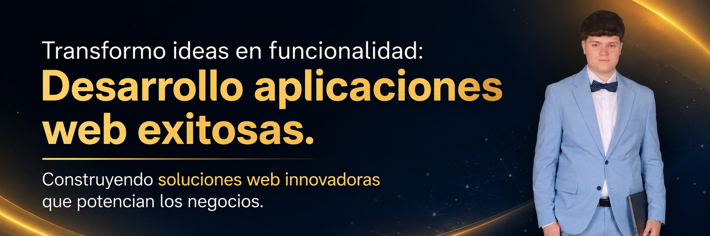

# Álvaro Castilla

  
  
  
  
  

### Full-Stack Developer · Almería, Andalucia (ES)

  Desarrollo software con una visión clara, cuidando la arquitectura, la experiencia de usuario y la calidad del código.

---

## Perfil profesional

Soy un desarrollador full-stack junior orientado a construir soluciones bien estructuradas, mantenibles y visualmente cuidadas. Me interesa combinar una base técnica sólida con una interfaz clara y una experiencia de usuario coherente.

Me adapto con facilidad a diferentes entornos de trabajo y disfruto participando en proyectos donde la organización, la calidad y la mejora continua son parte del proceso.

---

## Competencias técnicas

  <strong>Frontend</strong> 
  
  
  
  
  
    
  <strong>Backend</strong> 
  
  
  
  
  
  
    
  <strong>Herramientas</strong> 
  
  
  

---

## Enfoque

- Base técnica clara y estructura ordenada.
- Interfaz limpia y experiencia de usuario cuidada.
- Aprendizaje continuo y adaptación a nuevos entornos.
- Comunicación y entrega responsable.

---

## Estado actual

Me encuentro profundizando en arquitectura de software, integración frontend-backend y en el uso de Vue dentro de mi stack principal.

---

## Proyectos destacados

<table>
  <tr>
    <td width="50%" valign="top">
      <h3 align="center">DeTuBarrio</h3>
      

        
      

      

        
        
        
        
        
      

      

        Aplicación Full-Stack para conectar vecinos con comercios y servicios de barrio. Plataforma de proximidad con autenticación, geolocalización y panel de administración.
      

    </td>
    <td width="50%" valign="top">
      <h3 align="center">Restaurante TPV</h3>
      

        
      

      

        
        
        
      

      

        Sistema de gestión y punto de venta para hostelería. Control de pedidos, mesas, inventario y generación de tickets.
      

    </td>
  </tr>
  <tr>
    <td width="50%" valign="top">
      <h3 align="center">App Backend con Bottle</h3>
      

        
      

      

        
        
      

      

        API backend construida con el microframework Bottle en Python. Rutas REST, manejo de peticiones y estructura modular para aplicaciones ligeras.
      

    </td>
    <td width="50%" valign="top">
      <h3 align="center">Gestión de Estudiantes</h3>
      

        
      

      

        
        
        
        
        
      

      

        Aplicación web para la gestión de estudiantes, cursos y matrículas. Panel administrativo con autenticación, CRUD completo.
      

    </td>
  </tr>
</table>

---

## Contacto

  
  
  

---

## Filosofía profesional

> La tecnología tiene valor cuando resuelve problemas reales con claridad, calidad y responsabilidad.

### Puedes revisar mi [currículum](./Alvaro%20Castilla%20cv.pdf) o contactarme directamente.

